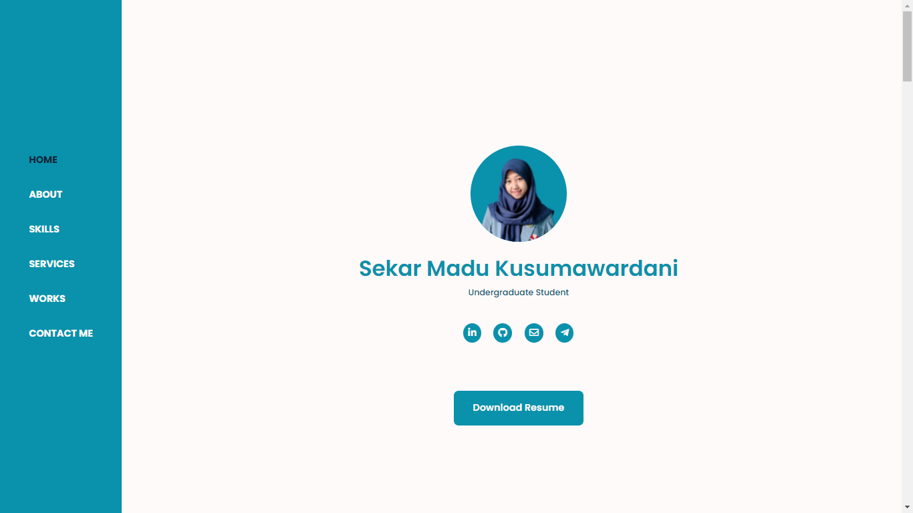
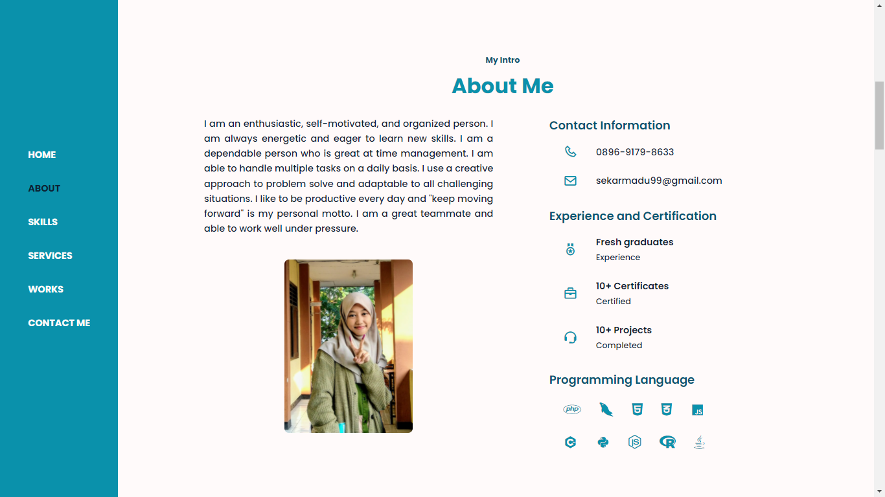

# My Web Portfolio
```
Created : September 28th 2021
```
> This repository was created as a web page for the owner's portfolio so that it can be accessed via the internet.

### Preview



### Tech
* [CSS](https://www.w3.org/Style/CSS/Overview.en.html) - is a simple mechanism for adding style (e.g., fonts, colors, spacing) to Web documents.
* [JavaScript](https://www.javascript.com/) - a scripting language to create dynamically updating content, control multimedia, animate images, and pretty much everything else.

### Tools
* [Visual Studio Code](https://code.visualstudio.com/) - a code editor redefined and optimized for building and debugging modern web and cloud applications.
* [Google Chrome](https:/google.com/) - a cross-platform web browser developed by Google.

### Running & Installation
You can simply open this web page via internet by clicking this link : [https://sekarmk03.github.io](https://sekarmk03.github.io)
Or if you want to run the web from your local, just follow these rules
1. Save all files into your local folder
2. Open a browser
3. Open file index.html

### Credits
[Sekar Madu Kusumawardani](https://instagram.com/sekarmk03/)